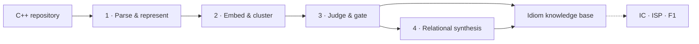

<div align="center">



<br />

[**English**](./README.md) · [简体中文](./README.zh-CN.md)

<br />


**Mine reusable C++ knowledge—not just repeated syntax.**

Zero-build parsing · semantic clustering · evidence-grounded quality gates · relational synthesis

</div>

> [!NOTE]
> This portfolio snapshot focuses on the strongest results from the three repositories that completed the full pipeline: **LevelDB, Ninja, and toml++**. The complete main-method and baseline ledger remains available in [results/README.md](results/README.md).

## Why CodeIdiomMine

Repeated code is easy to find. A reusable *idiom* is harder: its semantics must remain stable across occurrences, its boundary must be meaningful, and it must carry enough evidence to justify reuse. CodeIdiomMine turns that research problem into an auditable four-stage system.

| Capability | What it contributes |
| --- | --- |
| **Zero-build C++ analysis** | Extracts exact source extents, AST structure, functions, and multi-granularity candidates without compiling third-party repositories. |
| **Semantic opportunity discovery** | Encodes candidates with UniXcoder, tunes density clustering, and conservatively merges related clusters inside each repository. |
| **Evidence-grounded judgment** | Combines deterministic rules with semantic, reuse-value, taxonomy, and code-smell reviews instead of accepting similarity alone. |
| **Relational synthesis** | Discovers accepted idioms that co-occur in the same function region and composes only combinations with explicit data, control, lifecycle, or error-handling relations. |

## Results at a glance

The completed experiment starts with **912 non-noise clusters / 4,108 members**, accepts **264 base idioms**, and adds **4 high-quality relational syntheses** for **268 final idioms**.

| Repository | Opportunity functions | Covered AST nodes | Final idioms | IC | ISP | F1 |
| --- | ---: | ---: | ---: | ---: | ---: | ---: |
| LevelDB | 881 | 29,898 | 126 | 0.3957 | 0.7063 | 0.5073 |
| Ninja | 573 | 19,892 | 95 | 0.2786 | 0.6737 | 0.3942 |
| toml++ | 174 | 15,000 | 47 | 0.8220 | 0.8511 | 0.8363 |
| **Macro average** | **542.67** | **21,596.67** | **89.33** | **0.4988** | **0.7437** | **0.5793** |

`IC` measures opportunity-domain coverage, `ISP` measures exact function-domain support, and `F1` is their harmonic mean. Five-fold evaluation is split by file so a file never appears in both the reference and measurement side of a fold.

## What it actually discovers

The strongest result is not a single giant template. It is a hierarchy of reusable knowledge, from precise language-level constraints to repository-specific behavior and multi-idiom compositions.

| Level | Representative discovery | Evidence |
| --- | --- | --- |
| **Micro idiom** | Explicitly delete copy operations to preserve object identity | LevelDB · 57 occurrences · 26 files · quality **92.65** |
| **Behavioral idiom** | Decode LevelDB varints with bounded continuation and failure semantics | LevelDB · 12 occurrences · 2 files · quality **93.8** |
| **Relational composite** | Normalize node types, guard empty views, dispatch visitors, and preserve value categories as one operation | toml++ · Stage 4 synthesis · quality **96** |

<details>
<summary><strong>Micro · non-copyable object contract</strong></summary>

```cpp
BlockBuilder& operator=(const BlockBuilder&) = delete;
```

The pattern is short, but the mined intent is not: copying is deliberately forbidden to preserve identity and ownership constraints across many LevelDB types.

</details>

<details>
<summary><strong>Behavioral · bounded varint decoding</strong></summary>

```cpp
const char* GetVarint64Ptr(const char* p, const char* limit, uint64_t* value) {
  uint64_t result = 0;
  for (uint32_t shift = 0; shift <= 63 && p < limit; shift += 7) {
    uint64_t byte = *(reinterpret_cast<const uint8_t*>(p));
    p++;
    if (byte & 128) {
      result |= ((byte & 127) << shift);
    } else {
      *value = result | (byte << shift);
      return reinterpret_cast<const char*>(p);
    }
  }
  return nullptr;
}
```

The cluster connects encode/decode variants and `Slice`-advancing wrappers under one repository-specific binary-format contract, including truncation and malformed-input behavior.

</details>

<details open>
<summary><strong>Composite · type normalization + null guard + visitor dispatch</strong></summary>

```cpp
template <typename T>
auto* make_node_impl(T&& val,
                     value_flags flags = preserve_source_value_flags) {
  using unwrapped_type = unwrap_node<remove_cvref<T>>;

  if constexpr (std::is_same_v<unwrapped_type, node> ||
                is_node_view<unwrapped_type>) {
    if constexpr (is_node_view<unwrapped_type>) {
      if (!val)
        return static_cast<toml::node*>(nullptr);
    }

    return static_cast<T&&>(val).visit([flags](auto&& concrete) {
      return static_cast<toml::node*>(make_node_impl_specialized(
          static_cast<decltype(concrete)&&>(concrete), flags));
    });
  }

  return make_node_impl_specialized(static_cast<T&&>(val), flags);
}
```

Stage 4 recovered the complete relation among type dispatch, empty-view protection, visitor-based specialization, flags propagation, and perfect forwarding. Independent quality and smell reviews accepted the synthesis at **96/100**.

</details>

## Method



| Stage | Primary entry point | Main artifact |
| --- | --- | --- |
| 1 · Parse and represent | [`src.parser.repo2data`](src/parser/README.md) | `dataset.pkl`, `audit.json`, `fragments.pkl` |
| 2 · Embed and cluster | [`src.mining`](src/mining/README.md) | `embeddings.pkl`, `clusters.pkl` |
| 3 · Judge and gate | [`src.idiom_judgment`](src/idiom_judgment/README.md) | `idiom-judgment.pkl` |
| 4 · Relational synthesis | [`src.idiom_synthesis`](src/idiom_synthesis/README.md) | `idiom-synthesis.pkl` |
| Evaluate | [`src.evaluation`](src/evaluation/README.md) | `evaluation.json` |

Each repository runs independently through all four stages. Cross-repository aggregation happens only after mining, so candidates, embeddings, clusters, and evidence never leak across project boundaries.

## Quick start

Requirements: Python 3.12, a locally cached UniXcoder model, and an LLM endpoint configured in `.env` for Stages 3–4.

```bash
python3.12 -m venv .venv
.venv/bin/python -m pip install -r requirements.txt
cp .env.example .env
```

<details>
<summary><strong>Run the complete pipeline on <code>repos/cli11</code></strong></summary>

```bash
.venv/bin/python -m src.parser.repo2data \
  --input repos --project cli11 \
  --output outputs/cli11/stage0/dataset.pkl \
  --audit-output outputs/cli11/stage0/audit.json \
  --fragment-output outputs/cli11/stage1/fragments.pkl \
  --embedding-model unixcoder --local-files-only

.venv/bin/python -m src.mining.code_embedding \
  --input outputs/cli11/stage1/fragments.pkl \
  --output outputs/cli11/stage2/embeddings.pkl \
  --model unixcoder --device cpu --batch-size 8

.venv/bin/python -m src.mining.dbscan_tuning \
  --input outputs/cli11/stage2/embeddings.pkl \
  --output outputs/cli11/stage2/clusters-raw.pkl \
  --report outputs/cli11/stage2/dbscan-tuning.json

.venv/bin/python -m src.mining.cluster_merge \
  --clusters outputs/cli11/stage2/clusters-raw.pkl \
  --embeddings outputs/cli11/stage2/embeddings.pkl \
  --output outputs/cli11/stage2/clusters.pkl \
  --report outputs/cli11/stage2/cluster-merge-report.json

.venv/bin/python -m src.idiom_judgment.judge_clusters \
  --input outputs/cli11/stage2/clusters.pkl \
  --source-root repos/cli11 --require-context \
  --checkpoint outputs/cli11/stage3/checkpoint.sqlite3 \
  --output outputs/cli11/stage3/idiom-judgment.pkl \
  --report outputs/cli11/stage3/report.json

.venv/bin/python -m src.idiom_synthesis.synthesize_idioms \
  --input outputs/cli11/stage3/idiom-judgment.pkl \
  --source-root repos/cli11 \
  --checkpoint outputs/cli11/stage4/checkpoint.sqlite3 \
  --output outputs/cli11/stage4/idiom-synthesis.pkl \
  --report outputs/cli11/stage4/report.json
```

</details>

To evaluate a finalized artifact:

```bash
mkdir -p results/main/cli11
cp outputs/cli11/stage4/idiom-synthesis.pkl results/main/cli11/

.venv/bin/python -m src.evaluation.idiom_metrics \
  --idiom-dir results/main/cli11 \
  --dataset outputs/cli11/stage0/dataset.pkl \
  --clusters outputs/cli11/stage2/clusters.pkl \
  --output results/main/cli11/evaluation.json \
  --mode within_project_kfold --folds 5
```

> [!IMPORTANT]
> Stages 3–4 can send source fragments to the model endpoint configured in `.env`. Confirm repository visibility, disclosure policy, and expected cost before running them.

## Repository map

| Path | Purpose |
| --- | --- |
| [`src/parser/`](src/parser/README.md) | Zero-build C/C++ parsing and candidate extraction |
| [`src/mining/`](src/mining/README.md) | Embeddings, clustering, tuning, and merging |
| [`src/idiom_judgment/`](src/idiom_judgment/README.md) | Deterministic and agentic quality gates |
| [`src/idiom_synthesis/`](src/idiom_synthesis/README.md) | Region discovery and relational composition |
| [`src/evaluation/`](src/evaluation/README.md) | Main metrics and reproducible baselines |
| [`results/README.md`](results/README.md) | Full experiment ledger; completed repositories are appended in place |
| [`docs/`](docs/README.md) | Research method, guides, and architecture |

## Validation

```bash
.venv/bin/python -m unittest discover -s tests -t . -v
.venv/bin/python scripts/check_shared_infrastructure.py --other ../WPF2React
```

<div align="center">

Built as a research-grade, inspectable path from **source code** to **reusable knowledge**.

</div>
