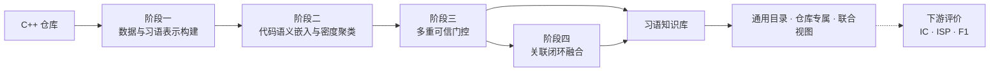

<div align="center">

# CodeIdiomMine

**面向 C++ 代码仓库的语义驱动代码习语挖掘、可信门控与闭环融合方法**

研究范围：基于静态源代码的候选表示、语义聚类、多重可信门控与关联闭环融合。


</div>

当前版本：**Sol 6.4**。

CodeIdiomMine 研究如何从独立 C++ 仓库中识别具有稳定语义与复用价值的细粒度代码模式。方法以零构建静态分析建立候选表示，经语义嵌入与密度聚类形成候选簇，再执行多重可信门控和关联闭环融合。

## Sol 6.4 核心变更

- 阶段4改用阶段3习语的完整簇成员位置建立区域倒排索引；聚类中心不重合但成员在
  同一 `project + file + function_extent` 中共现时也可进入合成，同一簇在单一区域
  内去重后仍可参与多个真实区域。
- 当前区域的 `matched_occurrences`、源码字节顺序和整文件 SHA-256 一同进入本地
  上下文门禁及 Agent 证据，簇级完整 `source_infos` 继续保留用于支持度与审计。
- 规划 Agent 每个区域只调用一次，以受 `max_plans_per_region` 限制的 `plans` 数组
  返回全部值得尝试且具有数据、控制、生命周期、异常处理或稳定顺序关系的组合，
  不枚举缺乏语义关系的数学子集。
- 编排层规范化、校验并去重候选索引，以区域和候选集合生成稳定组合键，再对每个
  合法计划独立执行组装、质量/类型复审和异味审查；单计划失败不影响同区域其他计划。
- 阶段4产物升级到 Schema v9，增加区域规划、成员匹配、稳定组合身份、逐计划轨迹
  和规划调用/合法计划汇总；SQLite checkpoint 仍以区域为提交单位并校验计划上限。
- 112项确定性离线测试全部通过；使用完全合成 C++ 的真实低档模型 smoke 验证了
  单区域一次规划返回两个唯一计划并分别完成下游审查，产物不作为正式研究结果。

## 四阶段方法与代码落点

| 阶段 | 代码入口 | 方法内容 | 主要产物 |
| --- | --- | --- | --- |
| **阶段一 · 数据与习语表示构建** | [`src/parser/`](src/parser/README.md) | 对 C++ 源码执行零构建静态分析，构建 AST、源码映射和语句/区域/函数多粒度候选，并生成满足模型预算的片段表示 | `dataset.pkl`、`dataset.audit.json`、`fragments.pkl` |
| **阶段二 · 代码语义嵌入与密度聚类** | [`src/mining/`](src/mining/README.md) | 使用 UniXcoder 编码候选语义，通过 DBSCAN 与冻结的领域目标调参生成仓库内候选簇，再执行仓库内保守归并 | `embeddings.pkl`、`clusters.pkl`、`clusters-merged.pkl`、报告 |
| **阶段三 · 多重可信门控** | [`src/idiom_judgment/`](src/idiom_judgment/README.md) | 对单簇执行合同/低价值过滤、受约束抽象、精简簇视图语义与复用价值评估、开放类型定型及独立异味门禁 | `idiom-judgment.pkl` 中的可信门控结果 |
| **阶段四 · 关联闭环融合** | [`src/idiom_synthesis/`](src/idiom_synthesis/README.md) | 从完整簇成员位置发现同一区域内的已接受习语共现，每区域一次批量规划全部有明确关系的有界组合，再逐计划独立组装、复核、分类与异味重审 | `idiom-synthesis.pkl` 闭环融合增量 |



每个仓库都独立完成上述四阶段。不同仓库的候选、向量、聚类和精炼证据不会混合；跨仓库汇总只发生在主流程完成后的知识组织阶段。评价是下游测量环节，不计入四阶段主流程；HDBSCAN 仅作为阶段二实验对照。

## 最小复现

已验证环境为 Apple Silicon macOS 与 Python 3.12.10：

```bash
/opt/homebrew/bin/python3.12 -m venv .venv
.venv/bin/python -m pip install --upgrade pip setuptools wheel
.venv/bin/python -m pip install -r requirements.txt
cp .env.example .env
```

以下以 `repos/cli11` 为例；UniXcoder 需已在本机缓存：

```bash
# 阶段一：数据与习语表示构建
.venv/bin/python -m src.parser.repo2data \
  --input repos --project cli11 \
  --output outputs/cpp/cli11/dataset.pkl \
  --fragment-output outputs/cpp/cli11/fragments.pkl \
  --embedding-model unixcoder --local-files-only

# 阶段二：代码语义嵌入与密度聚类
.venv/bin/python -m src.mining.code_embedding \
  --input outputs/cpp/cli11/fragments.pkl \
  --output outputs/cpp/cli11/embeddings.pkl \
  --model unixcoder --device cpu --batch-size 8 \
  --candidate-profile quality-v2

.venv/bin/python -m src.mining.dbscan_tuning \
  --input outputs/cpp/cli11/embeddings.pkl \
  --output outputs/cpp/cli11/clusters.pkl \
  --report outputs/cpp/cli11/dbscan-tuning.json

.venv/bin/python -m src.mining.cluster_merge \
  --clusters outputs/cpp/cli11/clusters.pkl \
  --embeddings outputs/cpp/cli11/embeddings.pkl \
  --output outputs/cpp/cli11/clusters-merged.pkl \
  --report outputs/cpp/cli11/cluster-merge-report.json

# 阶段三：多重可信门控
.venv/bin/python -m src.idiom_judgment.judge_clusters \
  --input outputs/cpp/cli11/clusters-merged.pkl \
  --source-root repos/cli11 --require-context \
  --checkpoint outputs/cpp/cli11/idiom-judgment.sqlite3 \
  --output outputs/cpp/cli11/idiom-judgment.pkl \
  --report outputs/cpp/cli11/idiom-judgment-report.json

# 阶段四：关联闭环融合
.venv/bin/python -m src.idiom_synthesis.synthesize_idioms \
  --input outputs/cpp/cli11/idiom-judgment.pkl \
  --input-kind judgment --source-root repos/cli11 \
  --max-plans-per-region 8 \
  --checkpoint results/cpp/cli11/idiom-synthesis.sqlite3 \
  --output results/cpp/cli11/idiom-synthesis.pkl \
  --report results/cpp/cli11/idiom-synthesis-report.json

# 下游评价：不计入四阶段主流程
.venv/bin/python -m src.evaluation.idiom_metrics \
  --idiom-dir results/cpp/cli11 \
  --dataset outputs/cpp/cli11/dataset.pkl \
  --output results/cpp/cli11/eval.json \
  --mode within_project_file_split --test-fraction 0.2
```

中间证据写入 `outputs/`，最终习语与评价写入 `results/`，运行记录追加到 `logs/`。后两阶段会向 `.env` 配置的模型端点发送候选源码；请先确认仓库公开性、数据披露范围与调用成本。长时任务支持带配置一致性校验的 SQLite checkpoint 与续跑。

## 文档导航

| 主题 | 入口 |
| --- | --- |
| 主流程 | [Parser](src/parser/README.md) · [嵌入与聚类](src/mining/README.md) · [多重可信门控（代码包 `idiom_judgment`）](src/idiom_judgment/README.md) · [关联闭环融合（代码包 `idiom_synthesis`）](src/idiom_synthesis/README.md) · [评价与 baseline](src/evaluation/README.md) |
| 知识与 Agent | [习语类型目录](docs/guides/idiom-taxonomy.md) · [Agent 架构](docs/guides/agent-system.md) · [Agent 公共基础设施](src/agents/README.md) · [LLM 基础设施](src/llm/README.md) |
| 工程与研究 | [CIMAS-CPP 研究方法](docs/research/01_C++代码习语挖掘研究稿.md) · [数据集分类与选取](docs/research/cpp-dataset-classification.md) · [输入仓库约定](repos/README.md) · [仓库架构](docs/guides/repository-architecture.md) · [测试指南](docs/guides/testing.md) · [公共基础设施](src/common/README.md) · [产物工具](src/utils/README.md) |
| 全部资料 | [文档索引](docs/README.md) |
