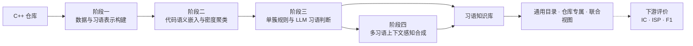

<div align="center">

# CodeIdiomMine

**面向 C++ 代码仓库的语义驱动代码习语挖掘、抽象与合成方法**

研究范围：基于静态源代码的候选表示、语义聚类、习语判定、代码异味过滤与多习语合成。


</div>

当前版本：**Sol 6.0**。

CodeIdiomMine 研究如何从独立 C++ 仓库中识别具有稳定语义与复用价值的细粒度代码模式。方法以零构建静态分析建立候选表示，经语义嵌入与密度聚类形成候选簇，再执行规则—LLM 协同判断和上下文感知合成。

## 四阶段方法与代码落点

| 阶段 | 代码入口 | 方法内容 | 主要产物 |
| --- | --- | --- | --- |
| **阶段一 · 数据与习语表示构建** | [`src/parser/`](src/parser/README.md) | 对 C++ 源码执行零构建静态分析，构建 AST、源码映射和语句/区域/函数多粒度候选，并生成满足模型预算的片段表示 | `dataset.pkl`、`dataset.audit.json`、`fragments.pkl` |
| **阶段二 · 代码语义嵌入与密度聚类** | [`src/mining/`](src/mining/README.md) | 使用 UniXcoder 编码候选语义，通过 DBSCAN 与冻结的领域目标调参生成仓库内候选簇 | `embeddings.pkl`、`clusters.pkl`、调参报告 |
| **阶段三 · 单簇规则与 LLM 习语判断** | [`src/idiom_judgment/`](src/idiom_judgment/README.md) | 对单个候选簇执行合同/低价值过滤、选择性抽象、语义与类型判定及独立代码异味审查 | `idiom-judgment.pkl` 中的 `accepted/rejected` 裁决 |
| **阶段四 · 多习语上下文感知合成** | [`src/idiom_synthesis/`](src/idiom_synthesis/README.md) | 对同一代表区域内的多个已接受习语执行关系规划、代码组装、质量复审、重新分类与异味门禁 | `idiom-synthesis.pkl` 合成增量 |



每个仓库都独立完成上述四阶段。不同仓库的候选、向量、聚类和判断证据不会混合；跨仓库汇总只发生在主流程完成后的知识组织阶段。评价是下游测量环节，不计入四阶段主流程；HDBSCAN 仅作为阶段二实验对照。

## 最小复现

已验证环境为 Apple Silicon macOS 与 Python 3.12.10：

```bash
/opt/homebrew/bin/python3.12 -m venv .venv
.venv/bin/python -m pip install --upgrade pip setuptools wheel
.venv/bin/python -m pip install -r requirements.txt
cp .env.example .env
```

以下以 `repos/cli11` 为例；UniXcoder 需已在本机缓存：

```bash
# 阶段一：数据与习语表示构建
.venv/bin/python -m src.parser.repo2data \
  --input repos --project cli11 \
  --output outputs/cpp/cli11/dataset.pkl \
  --fragment-output outputs/cpp/cli11/fragments.pkl \
  --embedding-model unixcoder --local-files-only

# 阶段二：代码语义嵌入与密度聚类
.venv/bin/python -m src.mining.code_embedding \
  --input outputs/cpp/cli11/fragments.pkl \
  --output outputs/cpp/cli11/embeddings.pkl \
  --model unixcoder --device cpu --batch-size 8 \
  --candidate-profile quality-v2

.venv/bin/python -m src.mining.dbscan_tuning \
  --input outputs/cpp/cli11/embeddings.pkl \
  --output outputs/cpp/cli11/clusters.pkl \
  --report outputs/cpp/cli11/dbscan-tuning.json

# 阶段三：单簇规则与 LLM 习语判断
.venv/bin/python -m src.idiom_judgment.judge_clusters \
  --input outputs/cpp/cli11/clusters.pkl \
  --source-root repos/cli11 --require-context \
  --checkpoint outputs/cpp/cli11/idiom-judgment.sqlite3 \
  --output outputs/cpp/cli11/idiom-judgment.pkl \
  --report outputs/cpp/cli11/idiom-judgment-report.json

# 阶段四：多习语上下文感知合成
.venv/bin/python -m src.idiom_synthesis.synthesize_idioms \
  --input outputs/cpp/cli11/idiom-judgment.pkl \
  --input-kind judgment --source-root repos/cli11 \
  --checkpoint results/cpp/cli11/idiom-synthesis.sqlite3 \
  --output results/cpp/cli11/idiom-synthesis.pkl \
  --report results/cpp/cli11/idiom-synthesis-report.json

# 下游评价：不计入四阶段主流程
.venv/bin/python -m src.evaluation.idiom_metrics \
  --idiom-dir results/cpp/cli11 \
  --dataset outputs/cpp/cli11/dataset.pkl \
  --output results/cpp/cli11/eval.json \
  --mode within_project_file_split --test-fraction 0.2
```

中间证据写入 `outputs/`，最终习语与评价写入 `results/`，运行记录追加到 `logs/`。判断与合成会向 `.env` 配置的模型端点发送候选源码；请先确认仓库公开性、数据披露范围与调用成本。长时任务支持带配置一致性校验的 SQLite checkpoint 与续跑。

## 文档导航

| 主题 | 入口 |
| --- | --- |
| 主流程 | [Parser](src/parser/README.md) · [嵌入与聚类](src/mining/README.md) · [习语判断](src/idiom_judgment/README.md) · [习语合成](src/idiom_synthesis/README.md) · [评价与 baseline](src/evaluation/README.md) |
| 知识与 Agent | [习语类型目录](docs/guides/idiom-taxonomy.md) · [Agent 架构](docs/guides/agent-system.md) · [Agent 公共基础设施](src/agents/README.md) · [LLM 基础设施](src/llm/README.md) |
| 工程与研究 | [CIMAS-CPP 研究方法](docs/research/01_C++代码习语挖掘研究稿.md) · [输入仓库约定](repos/README.md) · [仓库架构](docs/guides/repository-architecture.md) · [测试指南](docs/guides/testing.md) · [公共基础设施](src/common/README.md) · [产物工具](src/utils/README.md) |
| 全部资料 | [文档索引](docs/README.md) |
