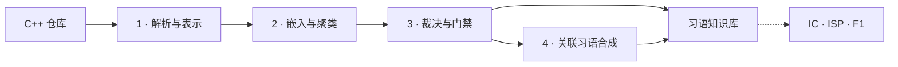

<div align="center">


<br />

[English](./README.md) · [**简体中文**](./README.zh-CN.md)

<br />


**挖掘可复用的 C++ 知识，而不只是重复语法。**

零构建解析 · 语义聚类 · 证据驱动质量门禁 · 关联习语合成

</div>

> [!NOTE]
> 本招牌项目首页聚焦已完成全流程的三个仓库：**LevelDB、Ninja 与 toml++**。主方法和所有 baseline 的完整实验台账见 [results/README.md](results/README.md)。

## 为什么是 CodeIdiomMine

重复代码容易发现，真正可复用的“习语”却必须同时具备稳定语义、合理边界和足够证据。CodeIdiomMine 将这一研究问题实现为可审计的四阶段系统。

| 能力 | 价值 |
| --- | --- |
| **零构建 C++ 分析** | 无需编译第三方仓库，即可提取精确源码范围、AST 结构、函数与多粒度候选。 |
| **语义机会发现** | 使用 UniXcoder 编码候选、调优密度聚类，并在单仓内保守合并相关候选簇。 |
| **证据驱动裁决** | 组合确定性规则、语义、复用价值、类型目录和代码异味审查，而非仅凭相似度接受候选。 |
| **关联闭环合成** | 发现同一函数区域内共现的已接受习语，仅组合具有明确数据、控制、生命周期或异常处理关系的候选。 |

## 核心结果

已完成实验从 **912 个非噪声簇 / 4,108 个成员**开始，接受 **264 个基础习语**，并新增 **4 个高质量关联习语**，最终得到 **268 个习语**。

| 仓库 | 机会域函数 | 覆盖 AST 节点 | 最终习语 | IC | ISP | F1 |
| --- | ---: | ---: | ---: | ---: | ---: | ---: |
| LevelDB | 881 | 29,898 | 126 | 0.3957 | 0.7063 | 0.5073 |
| Ninja | 573 | 19,892 | 95 | 0.2786 | 0.6737 | 0.3942 |
| toml++ | 174 | 15,000 | 47 | 0.8220 | 0.8511 | 0.8363 |
| **仓库宏平均** | **542.67** | **21,596.67** | **89.33** | **0.4988** | **0.7437** | **0.5793** |

`IC` 衡量机会域覆盖，`ISP` 衡量精确函数域支持，`F1` 为二者的调和平均。五折评价按文件切分，同一文件不会同时出现在一折的参考侧和测量侧。

## 实际挖掘出了什么

最有价值的结果并非一个庞大的通用模板，而是从精确语言约束、仓库行为到多习语组合的分层知识体系。

| 层级 | 代表性发现 | 证据 |
| --- | --- | --- |
| **微观习语** | 显式删除复制操作，保护对象身份约束 | LevelDB · 57 次出现 · 26 个文件 · 质量 **92.65** |
| **行为习语** | 带有界续读与失败语义的 LevelDB 变长整数解码 | LevelDB · 12 次出现 · 2 个文件 · 质量 **93.8** |
| **关联习语** | 将节点类型归一化、空视图保护、visitor 分派和值类别保持组合为完整操作 | toml++ · Stage 4 合成 · 质量 **96** |

<details>
<summary><strong>微观 · 不可复制对象契约</strong></summary>

```cpp
BlockBuilder& operator=(const BlockBuilder&) = delete;
```

代码很短，但挖掘出的意图并不浅：LevelDB 中多种类型通过禁止复制来保护对象身份和所有权约束。

</details>

<details>
<summary><strong>行为 · 有界变长整数解码</strong></summary>

```cpp
const char* GetVarint64Ptr(const char* p, const char* limit, uint64_t* value) {
  uint64_t result = 0;
  for (uint32_t shift = 0; shift <= 63 && p < limit; shift += 7) {
    uint64_t byte = *(reinterpret_cast<const uint8_t*>(p));
    p++;
    if (byte & 128) {
      result |= ((byte & 127) << shift);
    } else {
      *value = result | (byte << shift);
      return reinterpret_cast<const char*>(p);
    }
  }
  return nullptr;
}
```

该簇将编码/解码变体和推进 `Slice` 的包装接口统一到一个仓库特有二进制格式契约中，同时覆盖截断与非法输入行为。

</details>

<details open>
<summary><strong>关联 · 类型归一化 + 空值保护 + visitor 分派</strong></summary>

```cpp
template <typename T>
auto* make_node_impl(T&& val,
                     value_flags flags = preserve_source_value_flags) {
  using unwrapped_type = unwrap_node<remove_cvref<T>>;

  if constexpr (std::is_same_v<unwrapped_type, node> ||
                is_node_view<unwrapped_type>) {
    if constexpr (is_node_view<unwrapped_type>) {
      if (!val)
        return static_cast<toml::node*>(nullptr);
    }

    return static_cast<T&&>(val).visit([flags](auto&& concrete) {
      return static_cast<toml::node*>(make_node_impl_specialized(
          static_cast<decltype(concrete)&&>(concrete), flags));
    });
  }

  return make_node_impl_specialized(static_cast<T&&>(val), flags);
}
```

Stage 4 恢复了类型分派、空视图保护、visitor 特化、flags 传递与完美转发之间的完整关系；独立质量和异味复审以 **96/100** 接受该合成结果。

</details>

## 方法流程



| 阶段 | 主要入口 | 核心产物 |
| --- | --- | --- |
| 1 · 解析与表示 | [`src.parser.repo2data`](src/parser/README.md) | `dataset.pkl`、`audit.json`、`fragments.pkl` |
| 2 · 嵌入与聚类 | [`src.mining`](src/mining/README.md) | `embeddings.pkl`、`clusters.pkl` |
| 3 · 裁决与门禁 | [`src.idiom_judgment`](src/idiom_judgment/README.md) | `idiom-judgment.pkl` |
| 4 · 关联习语合成 | [`src.idiom_synthesis`](src/idiom_synthesis/README.md) | `idiom-synthesis.pkl` |
| 评价 | [`src.evaluation`](src/evaluation/README.md) | `evaluation.json` |

每个仓库独立完成四个阶段。跨仓汇总只发生在挖掘完成后，因此候选、嵌入、聚类和证据不会跨项目泄漏。

## 快速开始

环境要求：Python 3.12、本地已缓存的 UniXcoder，以及在 `.env` 中为 Stage 3–4 配置的 LLM 端点。

```bash
python3.12 -m venv .venv
.venv/bin/python -m pip install -r requirements.txt
cp .env.example .env
```

<details>
<summary><strong>在 <code>repos/cli11</code> 上运行完整流程</strong></summary>

```bash
.venv/bin/python -m src.parser.repo2data \
  --input repos --project cli11 \
  --output outputs/cli11/stage0/dataset.pkl \
  --audit-output outputs/cli11/stage0/audit.json \
  --fragment-output outputs/cli11/stage1/fragments.pkl \
  --embedding-model unixcoder --local-files-only

.venv/bin/python -m src.mining.code_embedding \
  --input outputs/cli11/stage1/fragments.pkl \
  --output outputs/cli11/stage2/embeddings.pkl \
  --model unixcoder --device cpu --batch-size 8

.venv/bin/python -m src.mining.dbscan_tuning \
  --input outputs/cli11/stage2/embeddings.pkl \
  --output outputs/cli11/stage2/clusters-raw.pkl \
  --report outputs/cli11/stage2/dbscan-tuning.json

.venv/bin/python -m src.mining.cluster_merge \
  --clusters outputs/cli11/stage2/clusters-raw.pkl \
  --embeddings outputs/cli11/stage2/embeddings.pkl \
  --output outputs/cli11/stage2/clusters.pkl \
  --report outputs/cli11/stage2/cluster-merge-report.json

.venv/bin/python -m src.idiom_judgment.judge_clusters \
  --input outputs/cli11/stage2/clusters.pkl \
  --source-root repos/cli11 --require-context \
  --checkpoint outputs/cli11/stage3/checkpoint.sqlite3 \
  --output outputs/cli11/stage3/idiom-judgment.pkl \
  --report outputs/cli11/stage3/report.json

.venv/bin/python -m src.idiom_synthesis.synthesize_idioms \
  --input outputs/cli11/stage3/idiom-judgment.pkl \
  --source-root repos/cli11 \
  --checkpoint outputs/cli11/stage4/checkpoint.sqlite3 \
  --output outputs/cli11/stage4/idiom-synthesis.pkl \
  --report outputs/cli11/stage4/report.json
```

</details>

评价最终产物：

```bash
mkdir -p results/main/cli11
cp outputs/cli11/stage4/idiom-synthesis.pkl results/main/cli11/

.venv/bin/python -m src.evaluation.idiom_metrics \
  --idiom-dir results/main/cli11 \
  --dataset outputs/cli11/stage0/dataset.pkl \
  --clusters outputs/cli11/stage2/clusters.pkl \
  --output results/main/cli11/evaluation.json \
  --mode within_project_kfold --folds 5
```

> [!IMPORTANT]
> Stage 3–4 可能向 `.env` 中配置的模型端点发送源码片段。运行前请确认仓库公开性、数据披露规则和预期调用成本。

## 仓库导航

| 路径 | 作用 |
| --- | --- |
| [`src/parser/`](src/parser/README.md) | 零构建 C/C++ 解析与候选提取 |
| [`src/mining/`](src/mining/README.md) | 嵌入、聚类、调参与合并 |
| [`src/idiom_judgment/`](src/idiom_judgment/README.md) | 确定性与 Agent 质量门禁 |
| [`src/idiom_synthesis/`](src/idiom_synthesis/README.md) | 区域发现与关联组合 |
| [`src/evaluation/`](src/evaluation/README.md) | 主指标与可复现 baseline |
| [`results/README.md`](results/README.md) | 全量实验台账；已完成仓库统一追加 |
| [`docs/`](docs/README.md) | 研究方法、指南与架构 |

## 验证

```bash
.venv/bin/python -m unittest discover -s tests -t . -v
.venv/bin/python scripts/check_shared_infrastructure.py --other ../WPF2React
```

<div align="center">

一条从**源代码**走向**可复用知识**的研究级、可审计路径。

</div>
